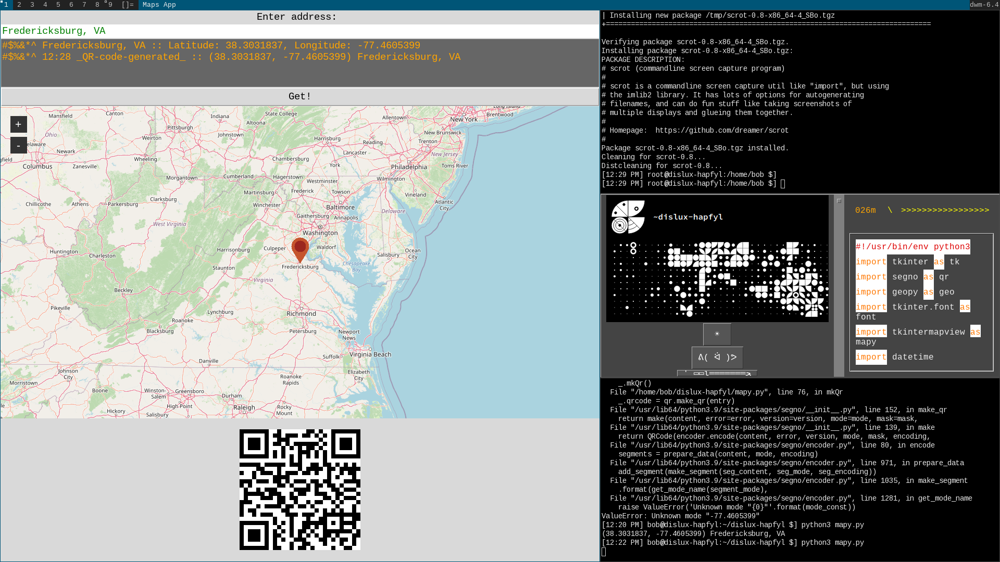

# mapy
A simple map getter that generates a QR.

Requires:

tkintermapview. https://github.com/TomSchimansky/TkinterMapView

segno. https://segno.readthedocs.io/en/latest/

geopy. https://geopy.readthedocs.io/en/stable/#installation

